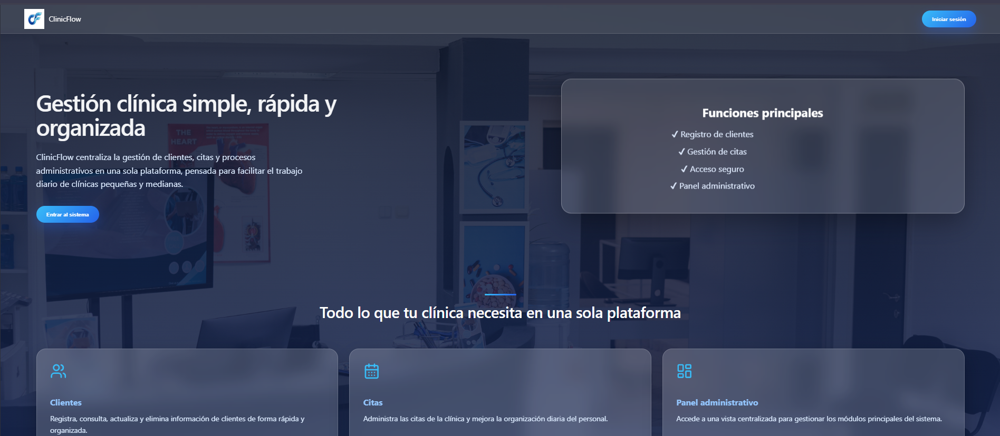
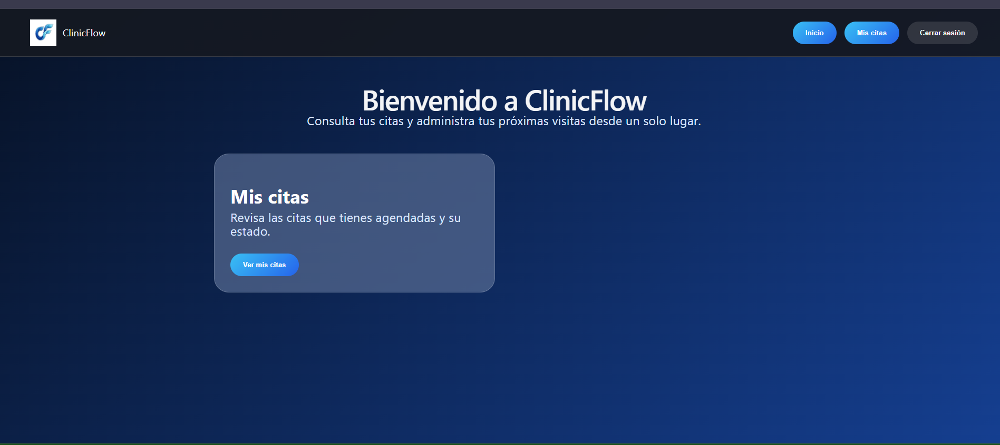
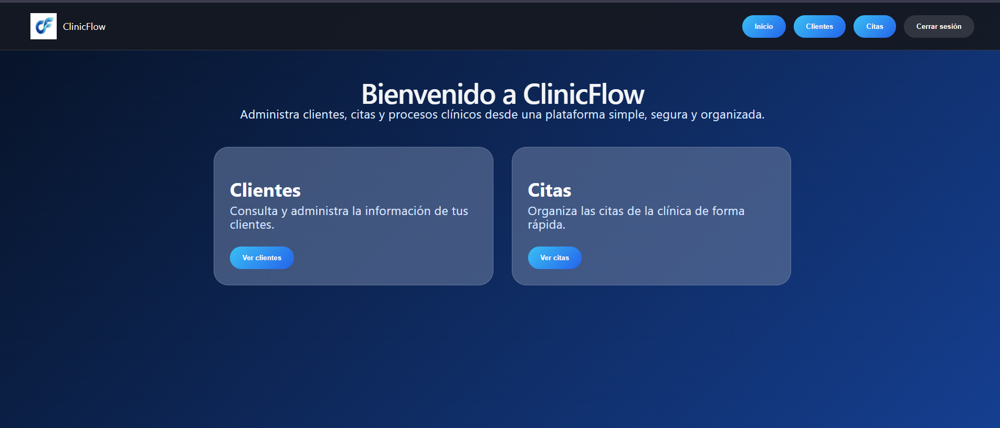

<div align="center">

# 🏥 ClinicFlow

### Sistema web Full Stack para gestión de clientes y citas clínicas

Aplicación desarrollada con **React + ASP.NET Core + SQL Server**, con autenticación JWT, autorización basada en roles y una API REST.


</div>

---

## ✨ Vista general

<p align="center">
  
</p>

**ClinicFlow** es una aplicación web Full Stack desarrollada para gestionar clientes y citas dentro de un entorno clínico.

El sistema cuenta con dos perfiles de acceso: **Cliente** y **Administrador**, cada uno con funcionalidades y permisos específicos.

---

## 📸 Funcionalidades por rol

### 👤 Portal del Cliente

El cliente puede consultar y administrar sus propias citas, manteniendo el acceso restringido a su información.

<p align="center">
  
</p>

**Funciones disponibles:**

- Registro e inicio de sesión.
- Persistencia de sesión mediante JWT.
- Consulta de citas propias.
- Creación de nuevas citas.
- Edición de citas.
- Cancelación de citas.
- Acceso restringido a sus propios registros.

### 🛡️ Panel Administrativo

El administrador dispone de una interfaz diferenciada para gestionar la información general del sistema.

<p align="center">
  
</p>

**Funciones disponibles:**

- Consulta y gestión de clientes.
- Activación e inactivación de clientes.
- Consulta general de citas.
- Navegación diferenciada según el rol.
- Acceso exclusivo a endpoints administrativos.

---

## 🧰 Stack tecnológico

| Área                     | Tecnologías                        |
| ------------------------ | ---------------------------------- |
| **Frontend**             | React, Vite, JavaScript, HTML, CSS |
| **Backend**              | C#, ASP.NET Core Web API           |
| **Base de datos**        | SQL Server                         |
| **ORM**                  | Entity Framework Core              |
| **Autenticación**        | JWT Bearer                         |
| **API**                  | REST, Swagger / OpenAPI            |
| **UI / Utilidades**      | SweetAlert2, jwt-decode            |
| **Control de versiones** | Git, GitHub                        |

---

## 🏗️ Arquitectura

```text
┌─────────────────────┐
│    React + Vite     │
│      Frontend       │
└──────────┬──────────┘
           │
           │ HTTP / JSON
           ▼
┌─────────────────────┐
│ ASP.NET Core Web API│
│       Backend       │
└──────────┬──────────┘
           │
           │ Entity Framework Core
           ▼
┌─────────────────────┐
│     SQL Server      │
│      Database       │
└─────────────────────┘
```

### Estructura del repositorio

```text
ClinicFlowAPI/
│
├── ClinicFlowAPI/       # Backend ASP.NET Core
├── clinicflow-web/      # Frontend React + Vite
├── docs/
│   └── images/          # Capturas del sistema
├── ClinicFlowAPI.sln
└── README.md
```

---

## 🔐 Autenticación y seguridad

ClinicFlow utiliza **JSON Web Tokens (JWT)** para autenticar usuarios y controlar el acceso a los recursos del sistema.

Entre las medidas implementadas se encuentran:

- Hashing de contraseñas.
- Autorización basada en roles `Cliente` y `Admin`.
- Endpoints protegidos mediante `[Authorize]`.
- Claims para identificar al cliente autenticado.
- Validación del `ClienteId` desde el token.
- Restricción para que cada cliente acceda únicamente a sus propias citas.
- Estado inicial de las citas controlado desde el backend.
- Validación de expiración del token.
- Configuración sensible almacenada fuera del repositorio mediante User Secrets.

> 🔒 Las claves JWT y cadenas de conexión reales no se almacenan en el código fuente.

---

## 👥 Control de acceso

| Funcionalidad             | Cliente | Admin |
| ------------------------- | :-----: | :---: |
| Iniciar sesión            |   ✅    |  ✅   |
| Gestionar citas propias   |   ✅    |  ❌   |
| Cancelar citas propias    |   ✅    |  ❌   |
| Consultar clientes        |   ❌    |  ✅   |
| Gestionar clientes        |   ❌    |  ✅   |
| Consultar todas las citas |   ❌    |  ✅   |

---

## ⚙️ Ejecución local

### Backend

Abrir la solución:

```text
ClinicFlowAPI.sln
```

Configurar mediante **ASP.NET Core User Secrets**:

```json
{
  "Jwt:Key": "TU_CLAVE_JWT",
  "ConnectionStrings:DefaultConnection": "TU_CADENA_DE_CONEXION"
}
```

Ejecutar el proyecto `ClinicFlowAPI` desde Visual Studio.

Durante el desarrollo, Swagger permite consultar y probar los endpoints de la API.

### Frontend

Acceder a:

```text
clinicflow-web
```

Instalar las dependencias:

```bash
npm install
```

Ejecutar el entorno de desarrollo:

```bash
npm run dev
```

La dirección de la API utilizada por el frontend se configura en:

```text
src/services/api.js
```

---

## 🎯 Objetivo del proyecto

ClinicFlow fue desarrollado como proyecto de portafolio para aplicar conocimientos de desarrollo **Full Stack** en un escenario funcional, incluyendo:

- Diseño y desarrollo de APIs REST.
- Integración entre React y ASP.NET Core.
- Persistencia de datos con Entity Framework Core.
- Gestión de datos con SQL Server.
- Autenticación mediante JWT.
- Autorización basada en roles y claims.
- Protección de recursos desde el backend.
- Manejo de sesiones desde el frontend.
- Separación de responsabilidades entre cliente y administrador.

---

<div align="center">

### 💻 Proyecto de portafolio Full Stack

**React · ASP.NET Core · SQL Server · JWT**

</div>
